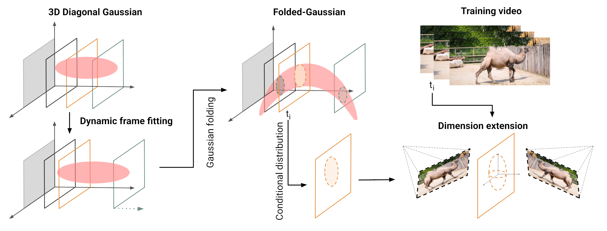

<div align="center">
<h1> VeGaS: Video Gaussian Splatting</h1>
Weronika Smolak-Dyżewska*, Dawid Malarz*, Kornel Howil*, Jan Kaczmarczyk, Marcin Mazur, Przemysław Spurek

(* denotes equal contribution)
<br> <br>


[](https://arxiv.org/abs/2411.11024)  [](https://gmum.github.io/VeGaS/) [](https://github.com/gmum/VeGaS)

</div>



This repository contains the implementation for the paper [VeGaS: Video Gaussian Splatting](https://arxiv.org/abs/2411.11024).

**Abstract:** Implicit Neural Representations (INRs) employ neural networks to approximate discrete data as continuous functions. In the context of video data, such models can be utilized to transform the coordinates of pixel locations along with frame occurrence times (or indices) into RGB color values. Although INRs facilitate effective compression, they are unsuitable for editing purposes. One potential solution is to use a 3D Gaussian Splatting (3DGS) based model, such as the Video Gaussian Representation (VGR), which is capable of encoding video as a multitude of 3D Gaussians and is applicable for numerous video processing operations, including editing. Nevertheless, in this case, the capacity for modification is constrained to a limited set of basic transformations. To address this issue, we introduce the Video Gaussian Splatting (VeGaS) model, which enables realistic modifications of video data. To construct VeGaS, we propose a novel family of Folded-Gaussian distributions designed to capture nonlinear dynamics in a video stream and model consecutive frames by 2D Gaussians obtained as respective conditional distributions. Our experiments demonstrate that VeGaS outperforms state-of-the-art solutions in frame reconstruction tasks and allows realistic modifications of video data.


# Installation Guide

Follow the steps below to set up the project environment:
##### Requirements:
 - CUDA-ready GPU with Compute Capability 7.0+
 - CUDA toolkit 12 for PyTorch extensions (we used 12.4)

#### 1. Clone the Repository
Clone the repository with its submodules to ensure all dependencies are included.  
```bash
git clone https://github.com/gmum/VeGaS.git --recursive
cd VeGaS
```

#### 2. Set Up a Virtual Environment
Create and activate a Python virtual environment using Python 3.8.
```bash
python3.8 -m venv env
source env/bin/activate
```

#### 3. Install PyTorch and torchvision
Install the PyTorch framework and torchvision for deep learning tasks.
```bash
pip3 install torch torchvision
```

#### 4. Install Project Submodules
Install the necessary submodules for Gaussian rasterization and k-nearest neighbors.
```bash
pip3 install submodules/diff-gaussian-rasterization
pip3 install submodules/simple-knn
```
#### 5. Install Additional Requirements
Install all other dependencies listed in the `requirements.txt` file.
```bash
pip3 install -r requirements.txt
```


## Tutorial
### 1. Training
```sh
python3 train.py -s <dataset_dir> -m <output_dir>
```
Before training, your video needs to be converted to individual frames (0000.png, 0001.png, ...).
The data directory needs to have a structure like this:
```
<data>
|---<original>
|   |---0000.png
|   |---0001.png
|   |---...
|---<mirror>
```

#### Other options
 
* ```--random_background``` Randomizes background during training. Use it if you want to train VeGaS on a video with a transparent backround.
* ```--poly_degree <int>``` Use to change polynomial degree of folded gaussians.
* ```--batch_size <int>``` Batch size.

### 2. Rendering
```sh
python3 render.py --model_path <model_dir> --interp <interp>
```
* ```--model_path``` Path to the model directory.
* ```--interp``` Multiplier for the framerate during interpolation. Use ```1``` for the original framerate (default), ```2``` for doubling the framerate, etc.

he rendered video is saved to the ```<model_dir>/render``` directory.
#### Editing gaussians
You can modify your render by manipulating Gaussians. Update the following function in render.py:
```python
def modify_func(means3D: torch.Tensor, # num_gauss x 3, means3D[:,1] = 0
                scales: torch.Tensor, # num_gauss x 3, scales[:,1] = eps
                rotations: torch.Tensor # # num_gauss x 4, 3D quaternions of 2D rotations
                time: float):
    return means3D, scales, rotations
```
function in ```render.py``` where 
* ```means3D``` - positions of the gaussians
* ```scales``` - scales of the gaussians
* ```rotations``` - rotation quaternions of the gaussians
* ```time``` - timestamp of the frame (between 0 and 1)

The shape of ```means3D``` and ```scales``` has to stay the same.

### 3. Saving pseudomesh
```sh
python3 save_psedomesh.py --model_path <model_dir>
```
* ```--model_path``` Path to the model directory.

This script saves GaMeS mesh file (```*.obj```) and point cloud file (```*.ply```) for each frame of the video in the ```<model_dir>/pseudomesh``` directory. These files can be edited in Blender or directly modified during rendering.

### 4. Rendering from mesh
```sh
python render_video.py --model_path <output_dir>
```
* ```--model_path``` Path to the model directory.

The rendered video is saved to the ```<model_dir>/render``` directory.
#### Other options

* ```--bg_model <str>``` Use to render other, a background model "behind" your main model. Useful if your main (foreground) model is transparent.


#### Editing mesh
It is possible to edit your render by manipulating a GaMeS mesh. You can achieve that by editing
```python
def modify_mesh(triangles: torch.Tensor, # num_gaussians x 3 x 3, triangles[:,:,1] = 0
                time: float
                ):
    return triangles
```
function in ```render_video.py``` where 
* ```triangles``` - pseudomesh, for each gaussian a triangle is defined with 3 points (each with 3 coordinates)
* ```time``` - timestamp of the frame (between 0 and 1)
 


------------------------------------

## Acknowledgments

Our code was developed based on [MiraGe](https://github.com/waczjoan/MiraGe/) and [gaussian-splatting](https://github.com/graphdeco-inria/gaussian-splatting).

<section class="section" id="BibTeX">
  <div class="container is-max-desktop content">
    <h2 class="title">Citations</h2>
If you find our work useful, please consider citing:
<h3 class="title">VeGaS: Video Gaussian Splatting

</h3>
    <pre><code>@Article{2024vegas,
      author={Weronika Smolak-Dyżewska and Dawid Malarz and Kornel Howil and Jan Kaczmarczyk and Marcin Mazur and Przemysław Spurek},
      title={VeGaS: Video Gaussian Splatting},
      year={2024},
      eprint={2411.11024},
      archivePrefix={arXiv},
      primaryClass={cs.CV},
      url={https://arxiv.org/abs/2411.11024}, 
}
</code></pre>

</div>

</section>
